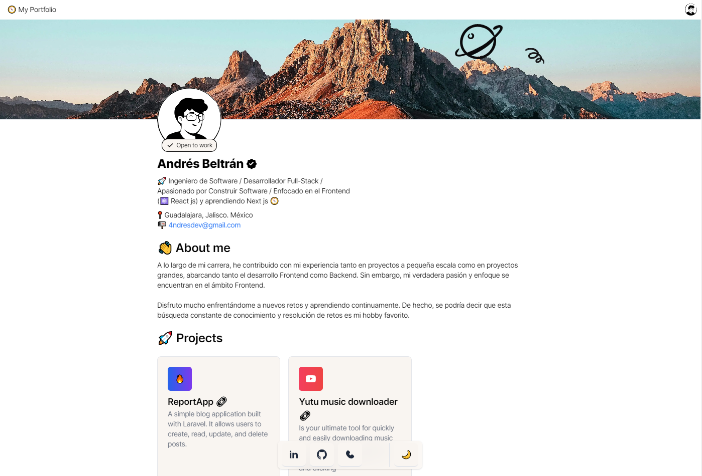
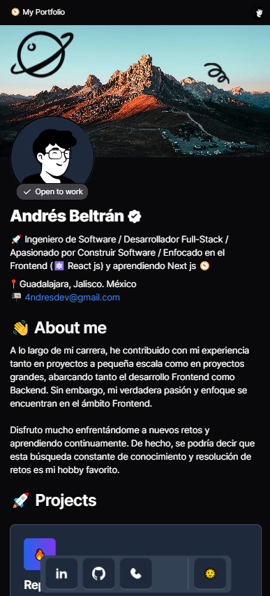

# 🔰 4ndresdev.com Portfolio

Welcome to my personal portfolio created with Astro!

## 🚀 Project Description

This portfolio showcases my work and skills. I have used [Astro](https://astro.build/), a modern framework that allows me to create fast and efficient websites. Here you will find a selection of my most notable projects, my professional experience, and ways to contact me.

## 🛠️ Technologies Used

- **Framework:** [Astro](https://astro.build/)
- **Languages:** HTML, CSS, JavaScript
- **Libraries:** React
- **Tools:** Git, GitHub, Figma, Tailwind CSS

## 📂 Project Structure

- `src/`: Contains the project source code, including components, pages, and static resources like images and icons.
  - `assets/`: Images, icons, and other static resources.
  - `components/`: Reusable components of Astro, such as `AboutMe`, `Header`, `Profile`, and `Projects`.
  - `layouts/`: General layouts for pages.
  - `pages/`: Site pages, including the home page and a 404 error page.
- `public/`: Publicly accessible static files.
- `astro.config.mjs`: Astro configuration.
- `tailwind.config.mjs`: Tailwind CSS configuration.
- `tsconfig.json`: TypeScript configuration.

## 🌈 Features

- **Modern Interface:** Clean and modern design for a better user experience.
- **Responsive:** Fully adapted for mobile devices.
- **Optimal Performance:** Loads quickly thanks to Astro.

## 📞 Contact

Would you like to learn more about my work or collaborate on a project? Feel free to contact me!

### Let's Connect on Social Media

- 
- 

### Send Me an Email

📧 [4ndresdev@gmail.com](mailto:4ndresdev@gmail.com)

---

Created with 💖 by [4ndesdev]